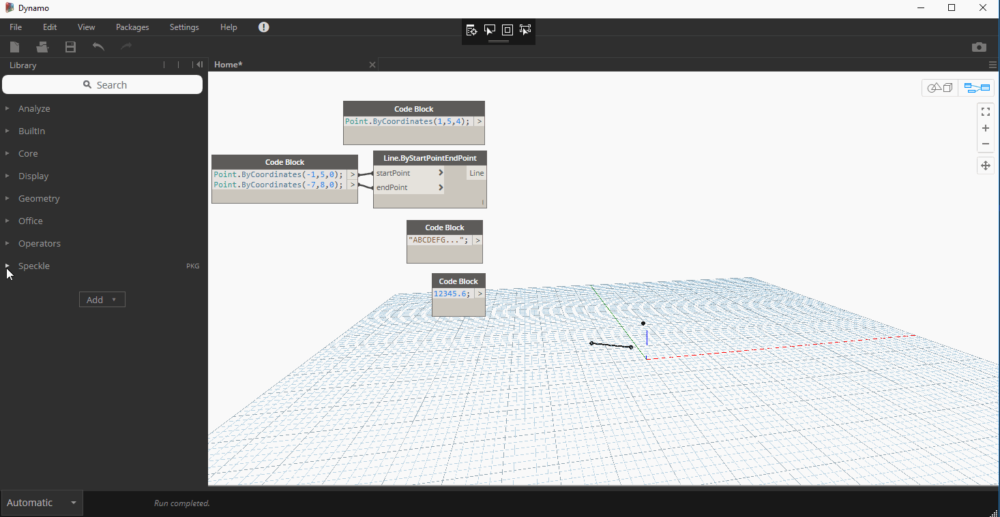
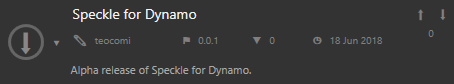
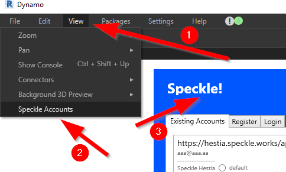

# Speckle for Dynamo

Speckle for Dynamo ~~0.0.1~~ **0.0.2 Alpha** is out!

**IMPORTANT:**

**The Receiver will often show a warning regarding `Dictionary.ByKeysValues operation failed`. [We are aware of that](https://github.com/speckleworks/SpeckleDynamo/issues/20) and are working with the Dynamo team to fix it. Nothing to worry about for the moment!**

##Installation

Install it from the package manager:

## Usage

Speckle for Dynamo is currently made up by 3 components:

The **Sender** lets you send data to Speckle receivers.

The **Receiver** lets you receive data from Speckle senders.

**Speckle Accounts** lets you manage your Speckle accounts and set the default account for new nodes, it can be accessed from: View > Speckle Accounts

## Bugs and feature requests

Please submit a new [issue](https://github.com/speckleworks/SpeckleDynamo/issues)!

# Dev notes

The SpeckleDynamo repo is currently made up by the following projects:

- SpeckleCore - submodule
- SpeckleDynamo - main project with receiver and sender component
- SpeckleDynamoConverter - the converter logic, compiles into a dll that is loaded by SpeckleCore using reflection see [Converter.cs](https://github.com/speckleworks/SpeckleCore/blob/master/SpeckleCore/Converter.cs#L135)
- SpeckleDynamoFunctions - custom Dynamo nodes implementing the NodeModels interface must be calling methods in a separate dll in order to return something (other than basic types). This project contains methods called by the Receiver `AstFactory.BuildFunctionCall`.
- SpecklePopup - login/registration popup, currently a clone of the one in the Rhino repo, to be added as a submodule
- SpeckleDynamoExtension - a Dynamo extension to add a `Speckle` item to the Dynamo menu bar, the sole scope of this is to let users set and change their default Speckle account, in the future more advanced functionalities could be added via the extension

### Build instructions

Set SpeckleDynamo as start project and rebuild all. 

Please make sure you have .NET Framework 2.0-3.5 installed, it might be missing on Windows 10.

### Debugging

**Post build events** have been set up to copy all required files into the Dynamo Core 2.0 folder.

A **start action** has been set to launch Dynamo Sandbox 2.0. 

**These can be changed in the .csproj file, but please don't set them from Visual Studio.**

*SpeckleDynamo* references all other projects, debugging it you can debug the other projects as well.

~~*SpeckleDynamoExtension* is not being referenced by Speckle Dynamo and should be debugged separately.~~

## About Speckle

Speckle reimagines the design process from the Internet up: an open source (MIT) initiative for developing an extensible Design & AEC data communication protocol and platform. Contributions are welcome - we can't build this alone!

## Credits

[Dimitrie](https://github.com/didimitrie), [Luis](https://github.com/fraguada), [Matteo](https://github.com/teocomi), [Alvaro](https://github.com/alvpickmans)